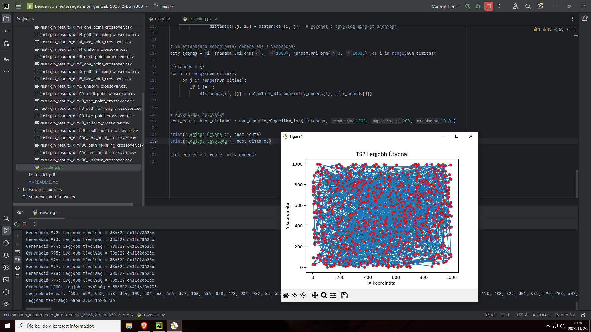
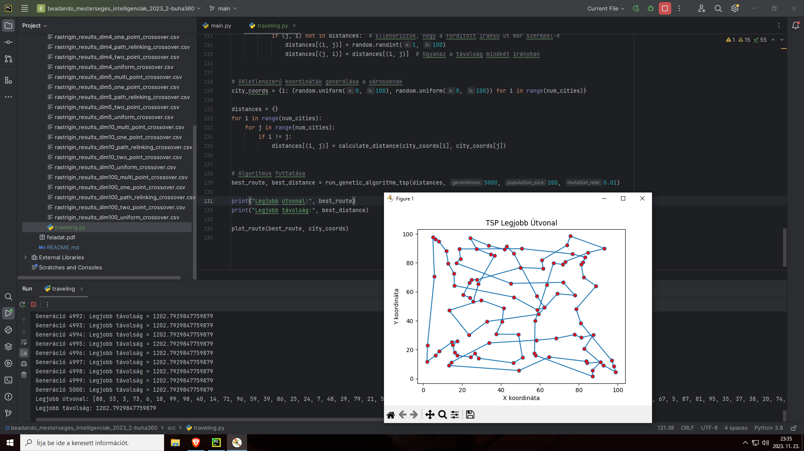
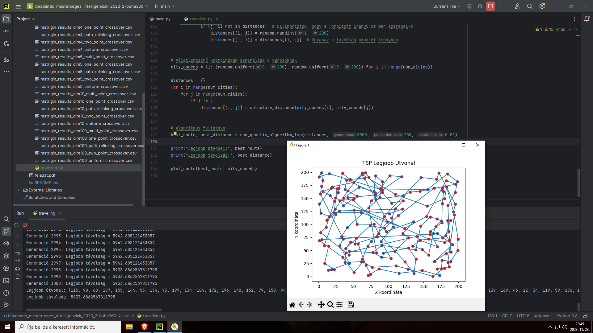
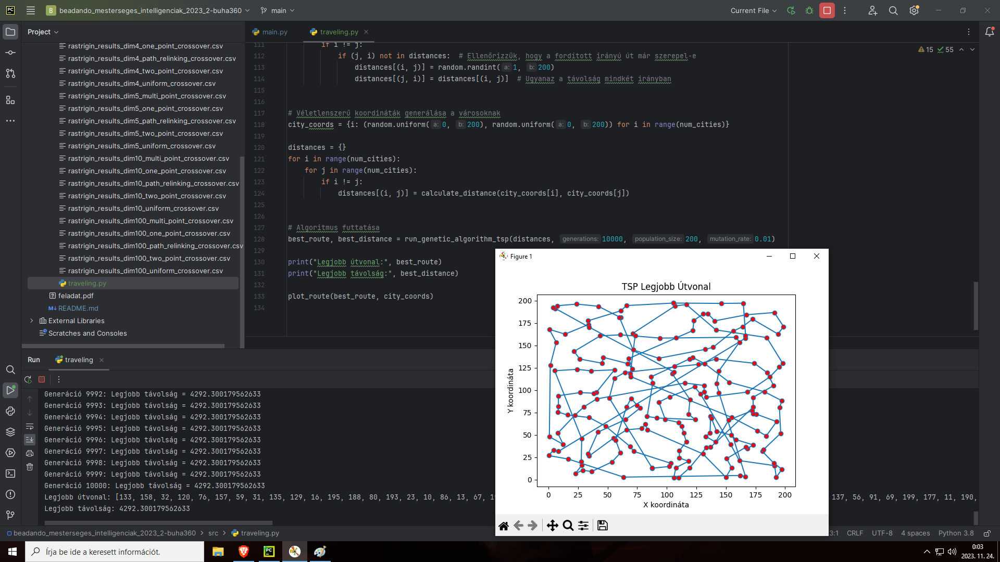

[**A feladat leírása**](feladat.pdf).

# Algoritmus(ok) ismertetése

# Feladat első része:
### 1. Célfüggvények (Fitness Functions)
Rastrigin Function: Egy nem-konvex függvény, amelyet gyakran használnak globális optimalizációs problémák vizsgálatára. A Rastrigin-függvény sok lokális minimummal rendelkezik, ami megnehezíti az algoritmus számára a globális minimum megtalálását.
Modified Rastrigin Function for Two Variables: A Rastrigin-függvény módosított változata két változóra.
n-Dimensional Rastrigin Function: A Rastrigin-függvény általánosítása tetszőleges dimenziószámra.
Booth Function: Egy kétváltozós függvény, amelynek a célja szintén optimalizációs problémák megoldása.
Levi Function: Egy másik kétváltozós optimalizációs probléma, amely szintén több lokális minimummal rendelkezik.

### 2. Populáció Inicializálása
Az initialize_population függvény létrehoz egy kezdeti populációt az algoritmus számára. Minden egyes egyed (vagy kromoszóma) a populációban egy potenciális megoldást képvisel a problémára, és véletlenszerűen generált értékekkel rendelkezik a megadott határok között.

### 3. Szelekció Módszerek
Rank Selection: A populáció egyedeit a fitness értékek alapján rangsorolja, és a legjobbakat választja ki a következő generáció számára.
Roulette Wheel Selection: Minden egyednek esélyt ad arra, hogy kiválasztásra kerüljön, arányosan a fitness értékével.
Tournament Selection: Véletlenszerűen kiválaszt egyedek közül választja ki a legjobbat több körben.

### 4. Keresztezési Módszerek
One-Point, Two-Point, és Multi-Point Crossover: Különböző módszerek, amelyekkel két szülő kromoszómából új utódokat hoznak létre.
Uniform Crossover: Minden gén esetében véletlenszerűen választ a szülők génjei közül.
Path Relinking Crossover: Egy útvonal-újraösszekapcsoló módszer, amely a szülők közötti útvonalakat kombinálja.

### 5. Mutáció
A mutáció véletlenszerű változásokat hoz létre az egyedekben, segítve ezzel az algoritmusnak, hogy elkerülje a lokális minimumokban való beragadást és felfedezzen új területeket a keresési térben.

### 6. Az Algoritmus Futtatása
Az run_genetic_algorithm függvény maga a genetikus algoritmus, amely iteratíven javítja a populációt a fent említett módszerekkel. A cél az, hogy megtalálja a legjobb megoldást (vagyis a legkisebb fitness értéket) a megadott generációk számán belül.

### 7. Kromoszómák és Evolúció
A kromoszómák a genetikus algoritmusban az egyedeket képviselik, amelyek a probléma potenciális megoldásait hordozzák. Az evolúció a kromoszómák változását és fejlődését jelenti a generációk során, amely a jobb megoldások felé halad.

### 8. Fitness
A fitness érték az egyedek "alkalmasságát" méri, vagyis hogy mennyire jók a probléma megoldásában. A genetikus algoritmus célja, hogy minimalizálja (vagy néhány esetben maximalizálja) ezt az értéket.

### 9. CSV Fájlba Írás
Az algoritmus eredményeit CSV fájlba menti, amely lehetővé teszi az eredmények későbbi elemzését és összehasonlítását.

# TSP:
Ez az algoritmus a genetikus algoritmus alkalmazása az Utazó Ügynök Problémára (TSP - Traveling Salesman Problem). A TSP célja, hogy megtalálja a legrövidebb lehetséges útvonalat, amelyen keresztül egy ügynök ellátogat minden városba pontosan egyszer, majd visszatér az eredeti városhoz.

### Fitness függvény (fitness_tsp):
Ez a függvény számítja ki az adott útvonal hosszát. Az útvonalon lévő minden várospár közötti távolság összeadódik. A függvény visszatérési értéke az útvonal teljes hossza.

### Populáció inicializálása (initialize_tsp_population):
A populáció minden egyede egy lehetséges útvonal a városok között. A függvény véletlenszerűen generál útvonalakat a városok között a populáció méretének megfelelően.

### Mutáció (mutate_tsp):
A mutáció során az útvonal egyes elemeit véletlenszerűen cseréljük, hogy diverzitást hozzunk létre a populációban.

### Keresztezés (crossover_tsp):
Két szülő útvonalból létrehoz egy új utódot. Az új utód egy része az egyik szülőtől, egy másik része a másik szülőtől származik.

### A genetikus algoritmus futtatása (run_genetic_algorithm_tsp):
Az algoritmus több generáción keresztül fut, ahol minden generációban a következő lépések történnek:

- A fitness értékek kiszámítása az aktuális populációnak.
- A legjobb egyedek kiválasztása (szelekció).
- Új egyedek (utódok) létrehozása a keresztezés és mutáció segítségével.
- Az új populáció összeállítása az utódokból és a legjobb meglévő egyedekből.
- A legjobb útvonal frissítése, ha találtunk jobbat.
- Útvonal kirajzolása (plot_route): A legjobb útvonal vizualizálása egy grafikonon, amely megmutatja az egyes városok közötti utat.

# Futási eredmények
Jelenlegi beállításokkal az feladat első része: "Az algoritmus teljes futási ideje: 348.4622766971588 másodperc"

# Néhány TSP megoldás:
### 1000 város, 1000 generáció, 200 populáció és 0.01 lépésköz
- 500k távolságról -> 386k-ra redukálás

### 100 város, 5000 generáció, 200 populáció és 0.01 lépésköz
- 5k távolságról -> 1.2k-ra redukálás

### 200 város, 3000 generáció, 200 populáció és 0.01 lépésköz
- 20k távolságról -> 5.9k-ra redukálás

### 200 város, 10000 generáció, 200 populáció és 0.01 lépésköz
- 20k távolságról -> 4.3k-ra redukálás

# Neurális Hálózat - CarGame
Ez a program egy egyszerű autós játékot valósít meg, ahol az egyedek neurális hálózat irányítja. A cél az, hogy az autók megtanuljanak navigálni a pályán különböző checkpointok elérésével.

## Neurális Réteg és Hálózat:

### NeuralLayer:
    - Egy réteg neurális hálózatot képvisel, amely tartalmazza a súlyokat és biasokat.

### NeuralNetwork:
    - Több rétegből álló neurális hálózat, amely előrejelzéseket végez.

### Autó Osztály:
    - Az egyedek mozgását, rajzolását, ütközésdetektálását és a neurális hálózat által hozott döntések kezelését végzi.
    - Szenzorok segítségével érzékeli a környezetét.

### Genetikai Algoritmus:
    - Az egyedek "genetikai kódjának" alapján neurális hálózatokat hoz létre és fejleszt.
    - Kiválasztási, keresztezési és mutációs folyamatokon keresztül fejleszti az egyedeket.

### Játékciklus:
    - Kezeli a felhasználói interakciókat és frissíti a játék állapotát.
    - Automatikusan vált generációt, ha az összes autó meghal...
    - Egyébként manuálisan a Space segítségével is lehet generációt váltani

# Tik Tak Toe - Minimax game
Ez a program TikTakToe játékot valósít meg, ahol a felhasználó egy "AI" ellen játszhat. Az AI a minimax algoritmust használja a döntéshozatalhoz, optimalizálva az esélyét a nyerésre.

## Leírás:
### Játéktábla Kezelése:
    - A játék egy 3x3-as táblán zajlik, ahol a játékosok felváltva helyezik el a 'X' és 'O' jeleket.

### Győzelem Feltételei:
    - A játékos akkor nyer, ha sikerül egy sorban, oszlopban vagy átlósan három jelét elhelyeznie.

### AI Döntéshozatal:
    - A minimax algoritmust használva kiszámítódik a legjobb lehetséges lépését. Az algoritmus a játék minden lehetséges kimenetelét előre számítja, és választja a legjobb stratégiát.

### Interakció a Felhasználóval:
    - A felhasználó megadja a lépését a koordináták formájában (sor, oszlop). A program ellenőrzi a lépés érvényességét.